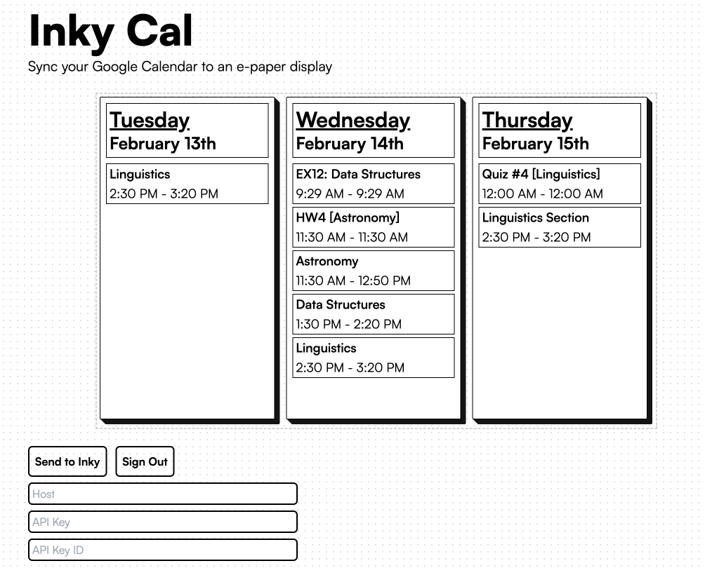
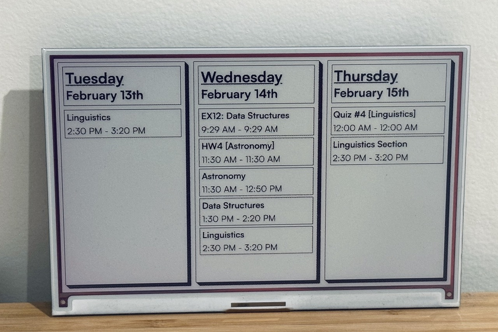

## Inky Cal

> Sync your Google Calendar to an e-paper display

<p align="center">
  
</p>

### Development

Inky Cal requires setting up a Google Cloud project and [enabling the Google Calendar API.](https://console.cloud.google.com/marketplace/product/google/calendar-json.googleapis.com)

Once set up, `.env.example` demonstrates the environment variables that need to be defined. Namely
`NEXT_PUBLIC_CLIENT_ID` and `NEXT_PUBLIC_API_KEY`

Viam is used to communicate to the e-paper display, in this case, an Inky Impression. Code for the driver [can be found here.](https://github.com/agavram/viam-inky) Feel free to make use of this driver, or swap in your own!

To run locally:

```bash
npm run dev
# or
pnpm dev
# or
bun dev
```

### Usage

After authenticating, enter your robot's credentials and press "Send to Inky" to see your display updated!

<p align="center">
  
</p>
